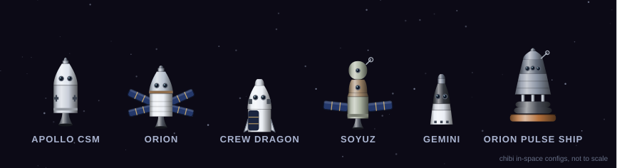
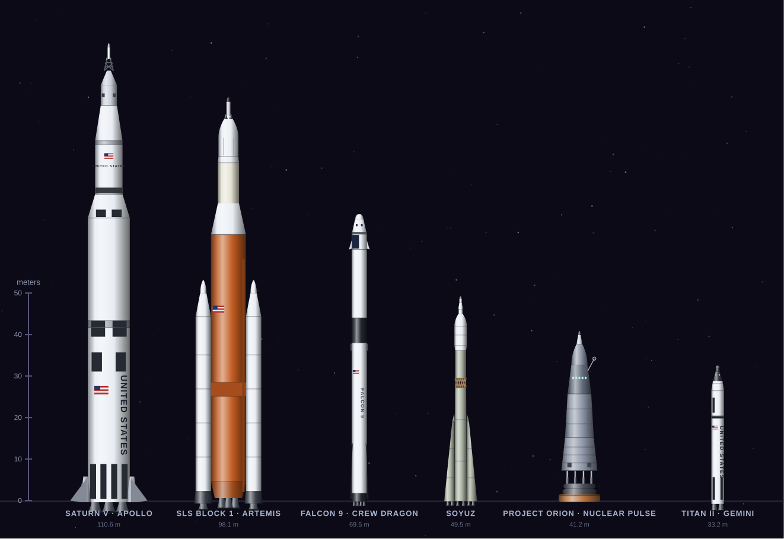
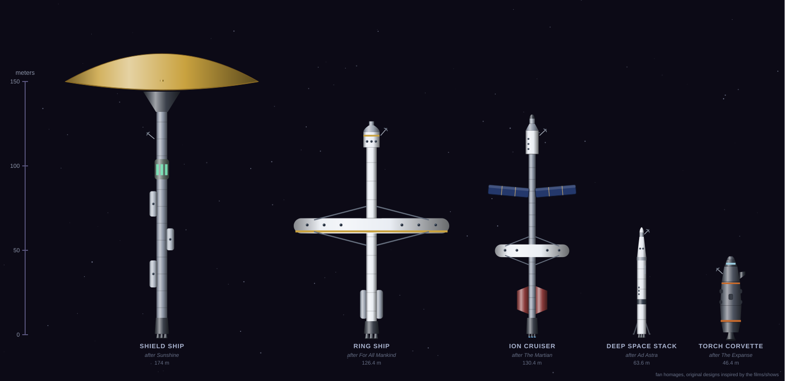
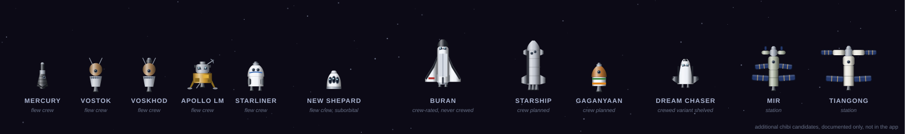
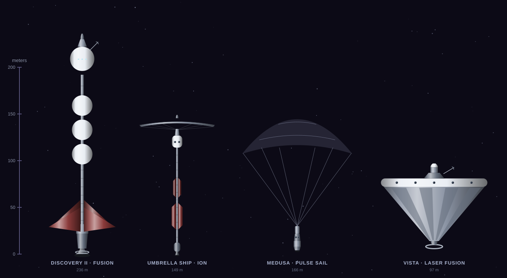

# high-frontier-fan-game

A fan implementation of **High Frontier 4: All** - the rocket-physics solar
system board game by Phil Eklund (Sierra Madre Games). Educational /
non-commercial.

Play the latest commit at [high-frontier-fan-game](https://rubentipparach.github.io/high-frontier-fan-game/).
Every push to every branch redeploys, so the most recent commit on any
branch is what's live.

## Admin Portal
https://high-frontier-fan-game.fly.dev/admin

## Features

- 1–5 player solar system race for water, factories, and glory
- Solar system map covering Earth/Moon/Mars/Venus/Mercury, main belt,
  Jupiter system, Saturn system, near-earth asteroids, and KBOs
- Ship construction from a deck of ~80 patent cards (thrusters,
  reactors, radiators, refineries, robonauts, generators, labs)
- Delta-v movement with ISP-aware burn cost
- Auctions, prospects, industrialization, and Bernal stations
- **Both async and realtime play** - leave a game and come back days
  later, or play in real time over WebSocket
- **Lobby + chat + invites** - find friends by name or share a
  one-click invite link
- Pure static frontend; no build step
- Express + sqlite + ws backend, single Fly.io machine

## Spacecraft

Every craft on the map is hand-drawn as a parametric side-profile SVG
(geometry, cylinder shading, and markings all generated by
`scripts/generate-background-rockets.mjs`). The chibi fleet flies in the
app today as ambient traffic drifting between worlds; the rest are
documented concepts and homages staged for later modules.

### Chibi fleet (live in the app)

Super-deformed in-space configurations, drifting between sites as
cosmetic background traffic. Not to a shared scale.



### Launch stacks (approved concepts)

Real launch configurations drawn to one shared scale (7 px per meter),
so they sit in a scene at true relative size.



### Module 1 homages

Original designs inspired by sci-fi screen ships (not replicas),
approved as the Module 1 era background fleet. Shared scale 3.5 px/m.



### Additional chibi candidates

Drawn and parked, awaiting a call on which join the ambient fleet.



### Future concepts (tabled)

Crewed interplanetary concepts from the Atomic Rockets catalogue, kept
as reference. Shared scale 2.5 px/m.



See `assets/background-rockets/README.md` for the full vehicle
inventory, scales, and sign-off status.

## Run locally

Frontend:

```sh
python3 -m http.server 8000
# open http://localhost:8000
```

Backend:

```sh
cd server
npm install
DATABASE_PATH=./hf-dev.db npm run dev
# listens on :8080
```

By default `index.html` points at the production Fly app. Edit the
`<meta name="hf-api-base">` tag to point at `http://localhost:8080`
for local dev.

## Project structure

See `CLAUDE.md` for the canonical architecture notes and rule-coverage
scope.

## One-time setup (repo owner)

The `.github/workflows/deploy.yml` workflow needs two one-time
prerequisites before it will deploy cleanly. Until you do these, the
first push will show the build job green but the two deploy jobs
will fail / skip.

### 1. GitHub Pages - allow every branch to deploy

By default the `github-pages` environment only allows the default
branch (`main`) to deploy. This project's promise is that every
branch deploys, so loosen the restriction:

1. Repo → **Settings** → **Pages** → set **Source** to *GitHub Actions*.
2. Repo → **Settings** → **Environments** → `github-pages` → **Deployment branches and tags**.
3. Change from *Protected branches only* to *All branches*, or add a
   pattern like `**` that matches any branch.
4. Re-run the workflow on the most recent commit; the `deploy` job
   will now succeed and you'll have the live URL in the run summary.

### 2. Fly.io - bootstrap the API app + token

The `deploy-api` job is a no-op (success, with a notice) until
`FLY_API_TOKEN` is set. To wire it up:

```sh
# Locally, with flyctl installed and authenticated:
fly apps create high-frontier-fan-game
fly volumes create hf_data --size 1 --region ams
fly tokens create deploy -a high-frontier-fan-game  # paste this value into the repo secret
```

Then add the token as `FLY_API_TOKEN` under repo →
**Settings** → **Secrets and variables** → **Actions** → **New
repository secret**. Subsequent pushes will deploy the API.

The frontend points at `https://high-frontier-fan-game.fly.dev` via the
`<meta name="hf-api-base">` tag in `index.html`. If your Fly app
lives at a different hostname, edit that meta value.

## Credits

High Frontier is © Phil Eklund / Ion game Design. This repository is
a fan project for personal play and learning, distributed under no
license that would suggest ownership of the game's design. If the
publisher requests takedown, this repo will be removed.
